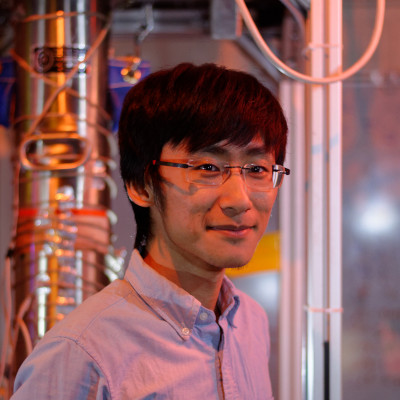

@def title = "Qin Juehang"
@def tags = ["bio", "homepage"]

# Bio
~~~

~~~
I am an experimental physicist specialising in astroparticle physics. My key research interest is in the direct detection of dark matter, but I am also interested in other aspects of astroparticle physics, such as neutrino astronomy. My main focus has been in the application of computational techniques, statistics, and machine learning to the fields of my interest, but I do also have experience with hardware.

I am currently a postdoc at Rice University; see my [ORCID](https://orcid.org/0000-0001-8228-8949) for up-to-date information.