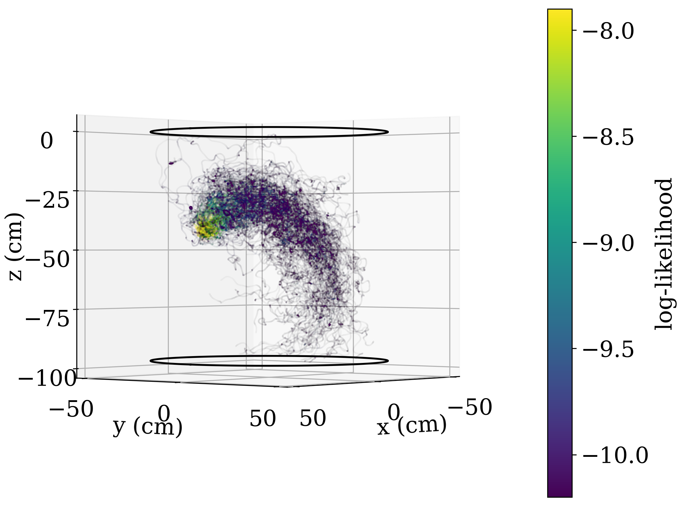
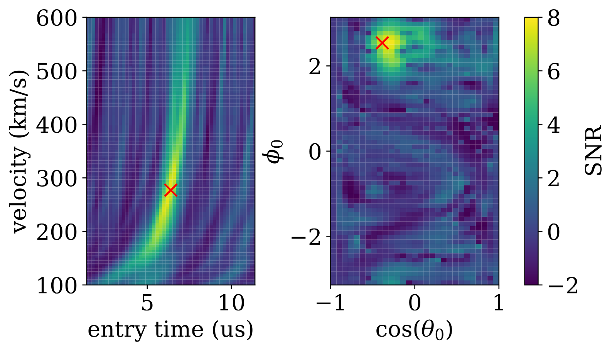

@def title = "Extending the search for dark matter with advanced algorithms"
@def tags = ["research", "thesis"]

# Extending the search for dark matter with advanced algorithms

*This essay about [my thesis](https://doi.org/10.25394/PGS.22790633) was awarded the Charlotte Ida Litman Tubis Award in [2023](https://www.physics.purdue.edu/about/prizes_awards/graduate_award_recipients.html#Tubis). As the award aims to promote clear and concise communication of scientific ideas beyond the physics and astronomy community, I figured I should upload this essay somewhere!*

## Introduction

Dark matter is one of the greatest scientific mysteries of our time. Historically, the first piece of evidence for dark matter was the rotation curve of galaxies. Using Newtonian physics, we can calculate how quickly stars should orbit a galaxy. However, when rotation curves were actually measured, most notably by Vera Rubin, it was noticed that the orbits suggest that galaxies are much heavier than expected from visible components, and their mass halos extended significantly further as well! Since then, many independent observations from the scale of galaxies to the largest scales of the universe have all pointed towards the existence of dark matter.

While it is generally accepted in modern cosmology with many independent pieces of supporting evidence, what dark matter is actually made of remains a great mystery. The lower bound for the range of masses of particles and objects that can comprise dark matter is $10^{-28}$ times the mass of an electron--that is $0.0\ldots 01$ with 27 zeros after the decimal point! The upper bound, on the other hand, is the mass of stars. Even before considering the myriad of hypothetical models of dark matter, that is a lot of room to search. Because of this, in my work, I am focused on extending the reach of dark matter searches to be both wider and deeper; to cover new areas in this massive range of possible masses we need to search in, and to make existing searches for dark matter more sensitive. The way I address these scientific goals is through the use of algorithms. In my PhD, I try to use algorithms to extend the search for dark matter, both by improving data analysis methods and by informing the hardware design of dark matter experiments.

## Software background reduction for XENON1T

XENON1T was a dark matter detector based at the Gran Sasso National Laboratory in Italy. This experiment is a particle detector that uses 2 tonnes of liquid xenon in the instrumented active region. The XENON1T experiment has been decommissioned in 2019, and an in-place upgrade called XENONnT has been constructed. XENONnT has 5.9 tonnes of instrumented liquid xenon. The primary goal of the XENON1T and XENONnT experiments is to look for Weakly Interacting Massive Particles (WIMPs), a dark matter model which predicts particles that are tens to hundreds of times heavier than the proton. The sensitivity of XENON1T, XENONnT, and other similar dark matter experiments can be improved if the rate of background events, which are events unrelated to dark matter, can be reduced. One way of reducing some of these backgrounds is by identifying and tagging them in software.

The goal of my work is to tag backgrounds in the XENON1T and XENONnT detectors caused by the decay of $^{214}$Pb. $^{214}$Pb decay is one of the major sources of background in XENON1T and XENONnT. This is because $^{214}$Pb comes from the decay chain of $^{222}$Rn, which is also a nobel gas and hence mixes well with liquid xenon. In addition, the decay of $^{214}$Pb is a beta-decay which produces one electron and one neutrino, and while the neutrino can carry some of the energy away, only the electron would be seen in the detector. Thus, the observed energy of the decay can be very low, making it hard to distinguish dark matter signals that are also expected to be low-energy.

Alpha decays are easy to select because they are monoenergetic and also produce a different ratio of scintillation photons to ionisation signal compared with other event types. The convective flow is thus measured using $^{222}$Rn and $^{218}$Po alpha decays in the detector. This is done by matching $^{222}$Rn and $^{218}$Po events into pairs, selecting the pairs that are most likely to be correct, while removing those events from the pool. These selected pairs represent velocity vectors. The raw velocity field is then processed to reduce the noise from position reconstruction uncertainties and to weigh pairs depending on their probability of being correct.

Finally, a point cloud can be propagated from every background event in an analysis ROI. This point cloud can be propagated forwards or backwards in time to search for $^{214}$Bi and $^{218}$Po events respectively, as they are the decays following and preceding a $^{214}$Pb decay in the decay chain. While $^{214}$Bi is also a beta decay with a spectrum extending down to low energies, it is easy to tag because the extremely short half life of the decay daughter, $^{214}$Po, means that every $^{214}$Bi decay is almost immediately followed up by a $^{214}$Po decay. If the point cloud encounters a $^{218}$Po or $^{214}$Bi event, the background event can be tagged as $^{214}$Pb. An illustration of such a point cloud is shown below in Fig 1.

*Fig. 1: Plot of a point cloud and the associated log-likelihood at each point. The log-likelihood represents a score that indicates how likely it is for an event*

## $^{88}$Y photo-neutron calibration

In this project, the XENONnT detector was calibrated using a $^{88}$Y-Be neutron source. This calibration uses $\gamma$-emission from $^{88}$Y to induce $^{9}$Be to emit $152 \text{ keV}$ neutrons. $152 \text{ keV}$ neutrons look similar to $^{8}$B solar neutrinos, hence allowing us to calibrate the detector response for such a measurement. This calibration is challenging as the energy of these events is extremely low, and many of the gamma rays actually escape the source instead of generating neutrons, presenting a high rate of events that are not useful for our calibration. The solution is thus to use a dense material to construct a gamma shield. Neutrons scattering off of such a heavy nucleus, such as tungsten or lead, loses very little energy, making such materials ideal for a selective shield that would block gamma rays but leave neutrons relatively unaffected.

Due to the physical constraints of upgrading XENON1T in-place to XENONnT, this calibration source, including shielding, is confined to a $16 \text{ cm}^3$ cube. Thus, the calibration system needs to be designed to make optimal use of the compact space. Thus, the geometry of the source assembly containing the gamma source and the beryllium is optimised using detailed simulations of the neutron source and associated gamma event rate in the XENONnT detector. The ratio of useful neutron events to gamma events is used as a figure-of-merit to determine the performance of various possible designs, allowing for a final optimised design to be selected.

## Windchime analysis

The Windchime project aims to use mechanical accelerometers to detect dark matter via the gravitational coupling alone. This is very exciting for two reasons. First, the gravitational interaction is the only interaction that Dark Matter is known to have, as dark matter is currently only observed indirectly via its gravitational effects. Second, the mass region around and above the Planck mass is a natural mass region to look for Dark Matter, as new physics is expected around the Planck mass scale, and there are many theoretical models for heavy dark matter around this mass scale. However, as the gravitational force is the weakest of the forces, this is expected to be extremely hard. Thus, the Windchime project is a project with a long time horizon, where we expect to have multiple generations of the experiment before one can gain sensitivity to dark matter via the gravitational interaction.

As part of my PhD, I worked on analysis methods for uncovering a track formed by long-range interactions in a large array of sensors, where the signal is below the noise floor of the array if one looks at the total signal. Despite this, I showed that it is possible to recover the signal using both template matching and Bayesian fitting using nested sampling with ultranest. A demonstration of this using template matching is shown in Fig 2.

I am also working on the estimation the look-elsewhere effect correction for such a computationally difficult problem. The look-elsewhere effect refers to the fact that the more independent experiments one does, the more often one would expect to get a statistically "surprising" result by chance. While it is easy to correct for this when one is doing multiple independent experiments, searching for a track that can come from any direction over a long period of time also results in many experiments that are effectively independent! For example, for tracks that are a few microseconds long, one would expect tracks from today and data from tomorrow to be essentially truly independent. However, the actual number of effectively independent trials, known as the trial factor, is not always easy to estimate -- while the result from a search of dark matter tracks days apart is obviously completely independent, what about microseconds apart, where the times of the tracks overlap? While this seems like a technical detail, an estimate of the trial factor is necessary to determine whether any signal is a statistical fluctuation, or is actually dark matter. Finally, I am working on a framework to estimate the sensitivity of Windchime accelerometer arrays with different quantum-sensing methods and array sizes. This would allow us to determine the sensitivity of large sensor arrays efficiently, and inform both the design of a first-generation Windchime experiment, and the R&D direction for the longer-term project.

*Fig. 2: 2D slices of a significance map obtained with simulated data. Even though the signal is buried below the noise for single sensors in this simulated dataset, a clear peak around the expected parameter values of a simulated dark matter track can be seen.*