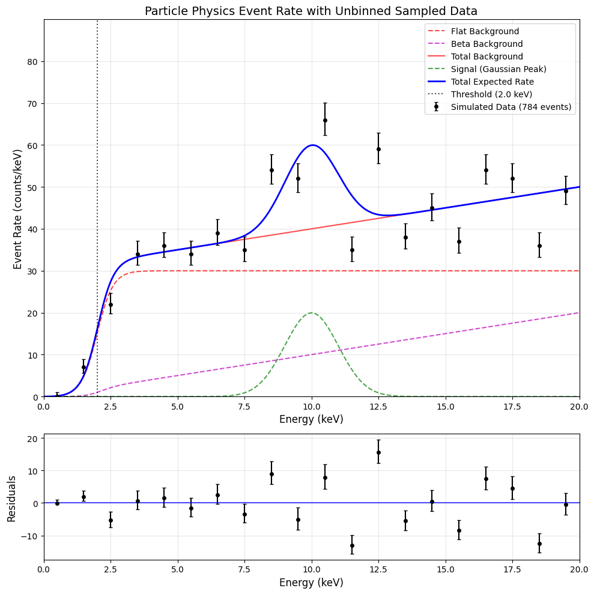

# A Brief Introduction to Bayesian Statistics

Note: This note borrows from *Bayesian Data Analysis, Andrew Gelman et al.*[^BDA], and *Probability Theory: The Logic of Science, E. T. Jaynes*[^probtheory]. These texts are recommended.

## Empiricism through the lens of "inverse problems"

Science is about "inverse problems".

Forward problems are typically what we learn from class. Given a model (eg. classical EM), and a set of known data, what should we measure? For example, for electrostatic forces, we would get
$$\mathbf{F} = \frac{1}{4\pi\varepsilon_0}\frac{q_1 q_2}{|r|^2}\hat{r}$$
If we know all the parameters, $q_1, q_2, r$, then we can compute the force. This is how we learn science. However, this is not how we _do_ science. When we do science, often times we have many observed variables, which are either controlled or measured, and latent variables, which cannot be directly observed but that we are interested in. In the context of the electrostatic force, we might be interested in the charge of an object, denoted $q_2$. We can indirectly measure this by setting up a known charge $q_1$ some known distance $r$ away from our unknown charge, measure $\mathbf{F}$, and infer $q_2$. This is known as an inverse problem [^inverse].

### What is the difficulty of inverse problems?

 1. There is often no simple one-to-one mapping between sets of observed variables and sets of latent variables. For example, if we are trying to localise a gravitational wave signal in the night sky, a single observation in both LIGO hanford and LIGO Livingston might be able to localise the event to a long band in the night sky, and there might be multiple disconnected regions that the two detectors alone cannot distinguish.
 2. We often do not know the observed quantities perfectly well.

## Quick introduction to probability and statistics

### Notation, definitions, conventions

For my lectures, we will be using a lot of probability notation. Here is a quick primer.

 - The probability of event $A$ happening is denoted $P(A)$.
 - The probability of $A$ or $B$ happening is denoted $P(A \cup B)$.
 - The probability of both $A$ and $B$ happening is denoted $P(A \cap B)$. This is also called a joint probability, and can be denoted $P(A, B)$.
 - The probability that $A$ occurs, given that $B$ occurs (eg. because $B$ has already occured or you want to know what would happen if $B$ were to occur) is called the *conditional probability* of $A$ given $B$, denoted $P(A|B)\equiv\frac{P(A \cap B)}{P(B)}$
 - Typically, capital $P$ would denote a discrete probability, whereas small $p$ would denote a probability density.

### What is probability?

**Frequentist:** Probabilities represent long-run frequencies. 
$$P(A) = \lim_{N_\mathrm{tot} \to \infty} \frac{N_\mathrm{A}}{N_\mathrm{tot}}$$
This is attractive as a way of codifying probability, as it forms an easily formalised definition.

**Bayesian:** Probabilities represent belief. This is vague, but intuitive. For example, we might say "It will likely rain tomorrow" to represent a belief that there is a $>50\%$ chance that it will rain. A frequentist would instead, and less intuitively, say that there is either a $0\%$ chance or a $1000\%$ chance, but we do not know which is correct!

## Bayesian probability is an extension to logic

In logic, we can have statements with truth values, and the truth values of statements can depend on other statements. For example:

 - $A$: It rained yesterday.
 - $B$: The roads were wet yesterday.

In this case, we can say that the truth of $B$ is conditional on $A$ being true. However, about statements for which the truth values are not perfectly predetermined? Consider the following two statements:
- $A$: It will rain tomorrow morning.
- $B$: The roads will be wet tomorrow evening.

As we are now talking about events in the future, the truth value of the events are not known. In fact, we might wish to represent them as probabilities! After running extensive weather simulations on a supercomputer, I might conclude that $P(A) = 30\%$. Given evaporation patterns and previous rainfall, we might conclude that $P(B|A) = 30\%$, and $P(B|\neg A) = 1\%$. Bayesian statistics gives us a way to reason about statements with truth values that we are not sure about. If we are reasoning about statements with truth values that we are not sure about, we might also want to have rules for updating our confidence in the truth of a statement in light of new evidence; if we see storm cloud brewing, we might want to update $P(A)$!

## Bayes' theorem

Bayes' theorem is the central rule for updating degrees of belief:
$$ P(A\vert B)={\frac {P(B\vert A)P(A)}{P(B)}}$$

This theorem can be derived from the definition of the conditional probabilities $P(A\vert B)$ and $P(B\vert A)$. We can work out a concrete example ([inspired by example from Wikipedia](https://en.wikipedia.org/w/index.php?title=Bayes%27_theorem&oldid=1278122377)). Suppose we are interested in testing for a certain condition in a broad population. Note that I am being deliberately vague here as the numbers are made up!  Let us further suppose that this condition or disease is quite rare, and that only $0.1\%$ pf the population has it; in other words:
$$P(\mathrm{Sick}) = 10^{-3}.$$

We have a very good test for this condition; someone who has this vague and mysterious illness has a $95\%$ chance of testing positive, whereas someone who does not only has a $2\%$ chance of testing positive:
$$P(\mathrm{Positive}|\mathrm{Sick}) = 0.95, P(\mathrm{Positive}|\neg\mathrm{Sick}) = 0.02.$$
If you get a positive test, should you freak out? In other words, what is $P(\mathrm{Sick}|\mathrm{Positive})$?

$$\begin{split}
P(\mathrm{Sick}|\mathrm{Positive}) &= \frac{P(\mathrm{Positive}|\mathrm{Sick})P(\mathrm{Sick})}{P(\mathrm{Positive})}\\
&=\frac{P(\mathrm{Positive}|\mathrm{Sick})P(\mathrm{Sick})}{P(\mathrm{Positive}|\mathrm{Sick})P(\mathrm{Sick}) + P(\mathrm{Positive}|\neg\mathrm{Sick})P(\neg\mathrm{Sick})}\\
&= \frac{0.95 \times 10^{-3}}{0.95\times10^{-3} + 0.02 \times (1-10^{-3})}\\
&\approx 0.045
\end{split}$$

In other words, if there is nothing to increase the prior probability (for example, if you had matching symptoms, that might be a reason to increase the prior belief of having this condition), even if you tested positive on a test, it is still more likely for you to not have the condition!

## Statistical modelling and probability functions

In physics, we often are not just dealing with discrete scenarios as above. Let us try out a classical particle physics scenario: a spectral fit with signal and background:

In this scenario, we expect $\mu_\mathrm{bg}\left(\vec{\theta}\right)$ background events, distributed in energy as $p_{\mathrm{bg}}\left(E|\vec{\theta}\right)$. Similarly, we expect $\mu_\mathrm{sig}\left(\vec{\theta}\right)$ signal events, distributed in energy as $p_{\mathrm{sig}}\left(E|\vec{\theta}\right)$. $\vec{\theta}$ denotes the parameters of this model, such as the signal strength, detector parameters, background rate, etc. Now, suppose we observe $N_\mathrm{obs}$ data points with energies $\vec{X} = \{E_i\}$.

Given such a model and data vector we would write Bayes' theorem as:
$$\begin{split}
p\left(\vec{\theta}|\vec{X}\right) = \frac{p\left(\vec{X}|\vec{\theta}\right)p\left(\vec{\theta}\right)}{p\left(\vec{X}\right)}.
\end{split}$$

Here, $p\left(\vec{\theta}|\vec{X}\right)$ is the posterior distribution we want, $p\left(\vec{X}|\vec{\theta}\right)$ is the likelihood function, and $p\left(\vec{\theta}\right)$ is the prior. We can think of the denominator, $p\left(\vec{X}\right)$, as a normalisation constant; after all, probability distributions like our posterior have to integrate to $1$, and our prior multiplied by our likelihood is not guaranteed to do so.

What is the explicit form of our likelihood? We can think about how we would write down $p\left(\vec{X}|\vec{\theta}\right)$ explicitly. We would read this as the probability density of our data points, $\vec{X}$, given a particular set of model parameters, $\vec{\theta}$. This tells us all we need to know!

Firstly, the total number of events should be Poisson distributed. We earlier stated that there are signal and background means $\mu_\mathrm{sig}\left(\vec{\theta}\right)$ and $\mu_\mathrm{bg}\left(\vec{\theta}\right)$; these summed together should be the Poisson rate parameter $\lambda$. In addition, we know the PDF as a function of energy for both the signal and the background components as $p_{\mathrm{sig}}\left(E|\vec{\theta}\right)$ and $p_{\mathrm{bg}}\left(E|\vec{\theta}\right)$. (In a practical modelling problem, these will all be specified explicitly! See the colab notebook.)

We can thus write the likelihood as such:

$$\begin{split}
p\left(\vec{X}|\vec{\theta}\right) =& 
\underbrace{\frac{\left(\mu_\mathrm{sig}\left(\vec{\theta}\right) + \mu_\mathrm{bg}\left(\vec{\theta}\right)\right)^{N} e^{-\left(\mu_\mathrm{sig}\left(\vec{\theta}\right) + \mu_\mathrm{bg}\left(\vec{\theta}\right)\right)}}{N!}}_\text{Poisson term for total number of events} \\
&\underbrace{\times\frac{1}{\mu_\mathrm{sig}\left(\vec{\theta}\right) + \mu_\mathrm{bg}\left(\vec{\theta}\right)}
\prod^N_i\left(\mu_\mathrm{sig}\left(\vec{\theta}\right)p_{\mathrm{sig}}\left(E_i|\vec{\theta}\right) + \mu_\mathrm{bg}\left(\vec{\theta}\right)p_{\mathrm{bg}}\left(E_i|\vec{\theta}\right)\right)}_{\text{Likelihood for event energies
}}.
\end{split}$$

<!-- ### Random equations for presentation:
$$p\left(\vec{X}\right) = \int_{\Theta} p\left(\vec{X}|\vec{\theta}\right)p\left(\vec{\theta}\right) d\vec{\theta}$$
$$P \left(\vec{\theta} | \vec{X} \right) = \int_{\Alpha} P \left( M, \vec{\theta}, \vec{\alpha} | \vec{X} \right) d\vec{\alpha}$$

$$q_{\vec{\phi}}\left(\vec{\theta}\right)$$ -->

## References

[^BDA]: Gelman, Andrew, et al. Bayesian data analysis. Chapman and Hall/CRC, 1995.
[^probtheory]: Jaynes, Edwin T. Probability theory: The logic of science. Cambridge university press, 2003.
[^inverse]: Cranmer, Kyle, Johann Brehmer, and Gilles Louppe. "The frontier of simulation-based inference." Proceedings of the National Academy of Sciences 117.48 (2020): [30055-30062](https://doi.org/10.1073/pnas.1912789117).